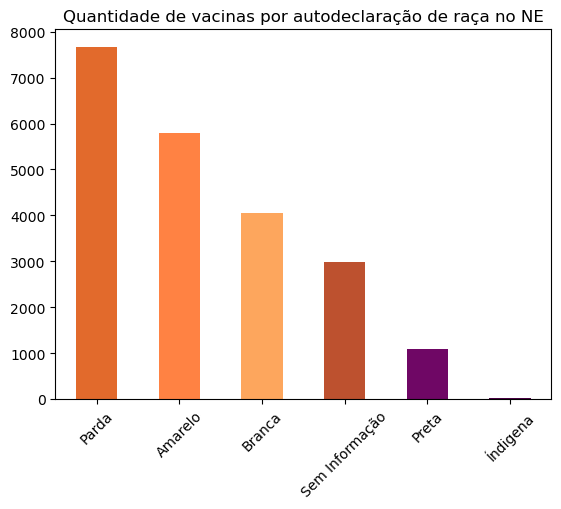
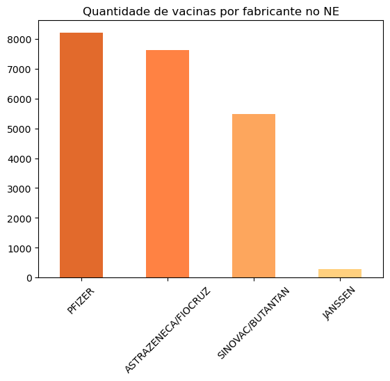

## Conceito
Projeto realizado na disciplina de Técnicas de Programação I do Bootcamp < Div >ersidade Tech.<br>
O projeto consiste em analisar dados de vacinação do COVID-19 na região do Nordeste, trazendo um olhar para fabricantes de vacinas aplicadas e recortes de gêneros e raças na região.
### Tecnologias Utilizadas

<div align="center">


</div>

## O Projeto 

#### Informações Técnicas
Utilizou-se as seguintes bibliotecas:
```
import basedosdados as bd
import pandas as pd
import matplotlib.pyplot as plt
```
Por conta do custo computacional para carregar as análises, foi calculado um tamanho de amostra que representasse os vacinados contra COVID-19 para cada Estado da região nordeste. Isso gerou um tamanho de amostra de 2401 por Estado. 

O filtro dos dados foram realizados com código SQL:
```
query_pacientes = "(SELECT estado_ma.sigla_uf_endereco, estado_ma.sexo, estado_ma.raca_cor FROM `basedosdados.br_ms_vacinacao_covid19.microdados_paciente` as estado_ma WHERE estado_ma.sigla_uf_endereco = 'MA' LIMIT 2401) \
UNION ALL (SELECT estado_ce.sigla_uf_endereco, estado_ce.sexo, estado_ce.raca_cor FROM `basedosdados.br_ms_vacinacao_covid19.microdados_paciente` as estado_ce WHERE estado_ce.sigla_uf_endereco = 'CE' LIMIT 2401) \
UNION ALL (SELECT estado_rn.sigla_uf_endereco, estado_rn.sexo, estado_rn.raca_cor FROM `basedosdados.br_ms_vacinacao_covid19.microdados_paciente` as estado_rn WHERE estado_rn.sigla_uf_endereco = 'RN' LIMIT 2401) \
UNION ALL (SELECT estado_pb.sigla_uf_endereco, estado_pb.sexo, estado_pb.raca_cor FROM `basedosdados.br_ms_vacinacao_covid19.microdados_paciente` as estado_pb WHERE estado_pb.sigla_uf_endereco = 'PB' LIMIT 2401) \
UNION ALL (SELECT estado_al.sigla_uf_endereco, estado_al.sexo, estado_al.raca_cor FROM `basedosdados.br_ms_vacinacao_covid19.microdados_paciente` as estado_al WHERE estado_al.sigla_uf_endereco = 'AL' LIMIT 2401) \
UNION ALL (SELECT estado_se.sigla_uf_endereco, estado_se.sexo, estado_se.raca_cor FROM `basedosdados.br_ms_vacinacao_covid19.microdados_paciente` as estado_se WHERE estado_se.sigla_uf_endereco = 'SE' LIMIT 2401) \
UNION ALL (SELECT estado_ba.sigla_uf_endereco, estado_ba.sexo, estado_ba.raca_cor FROM `basedosdados.br_ms_vacinacao_covid19.microdados_paciente` as estado_ba WHERE estado_ba.sigla_uf_endereco = 'BA' LIMIT 2401) \
UNION ALL (SELECT estado_pi.sigla_uf_endereco, estado_pi.sexo, estado_pi.raca_cor FROM `basedosdados.br_ms_vacinacao_covid19.microdados_paciente` as estado_pi WHERE estado_pi.sigla_uf_endereco = 'PI' LIMIT 2401)\
UNION ALL (SELECT estado_pe.sigla_uf_endereco, estado_pe.sexo, estado_pe.raca_cor FROM `basedosdados.br_ms_vacinacao_covid19.microdados_paciente` as estado_pe WHERE estado_pe.sigla_uf_endereco = 'PE' LIMIT 2401)"
```
```
df_paciente = bd.read_sql(query = query_pacientes, billing_project_id='YOUR_PROJECT_ID')
df_paciente.head()
```

### Conclusão

Através das análises apresentadas, a vacinação em grupos minoritários negros e indígenas é baixa, respectivamente 5% e 0.09% da amostra. A população autodeclarada Parda lidera entre os vacinados com 35,4%.



No recorte de gênero, 56% das mulheres vacinaram-se enquanto apenas 46% dos homens.

No cenário das fabricantes de vacinas contra COVID-19 é possível perceber que as doses foram majoritariamente da Pfizer e Astrazeneca/Fiocruz, com respectivamente 37,9% e 35,3%.

A Pfizer foi aplicada principalmente, dentre os Estados do NE, no Estado de Sergipe(SE) e Piauí(PI) com 41,4% e 40,3% respectivamente. Já a Astrazeneca/Fiocruz concentrou-se no Estado do Maranhã(MA) com 46,4%.


